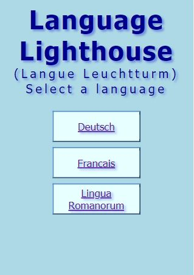
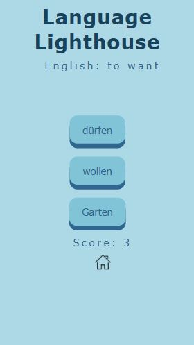

### Langue Leuchtturm (Language Lighthouse)
- A game for learning languages
- [Play the game here!](http://language-lighthouse.herokuapp.com/)

#### Languages:
- German
- French
- Latin

#### Screenshots:

##### APIs Created
- [German](http://language-lighthouse.herokuapp.com/api/german)
- [French](http://language-lighthouse.herokuapp.com/api/french)
- [Latin](http://language-lighthouse.herokuapp.com/api/latin)

##### JSON Data Headers
  - ID (database word id)
  - eng (Word/phrase in English)
  - ger/fre/lat (Word/phrase in other languages)
  - wordtype (noun/verb etc)
  - category (kitchen, house, anatomy etc)
  - gender (gender of nouns.  If no gender then n/a)
  - difficulty (easy/medium/hard)
  - declension (only for Latin)

#### Tech used
- Node / Express for building the app routes and APIs
- Postgres for the database
- APIs hosted on Heroku
- Jest for testing
- React front end

#### Features to be implemented
- Filtering word types by type, difficulty etc
- Game to test gender of nouns and declensions of Latin nouns
